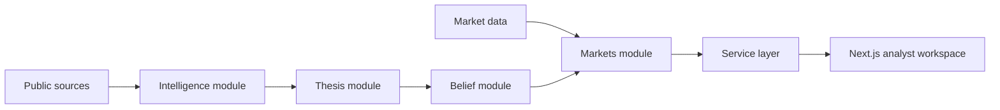

# SignalOS

SignalOS turns fast-moving public news into an inspectable prediction: what
changed, how strongly it matters, and why the current belief moved.

[Live showcase](https://signalos-showcase.vercel.app/showcase) ·
[Architecture](docs/architecture.md) ·
[Module map](docs/repo-map.md) ·
[Documentation](docs/README.md) ·
[Versioning](docs/versioning.md)

## The Core Loop

```text
public evidence -> meaning and strength -> belief update -> inspectable summary
```

The market price is an outside view. SignalOS preserves the causal layer beneath
it: source-backed evidence, model interpretation, and a replayable belief path.

## Architecture



The TypeScript domain is split into four public modules:

| Module | Responsibility | Public API |
| --- | --- | --- |
| `belief` | priors, confidence, updates, explanations | `@/modules/belief` |
| `markets` | market families and deterministic replay | `@/modules/markets` |
| `intelligence` | source normalization, clustering, briefings | `@/modules/intelligence` |
| `thesis` | evidence, scenarios, scoring, decisions | `@/modules/thesis` |

Application code imports only these public entry points. `npm run
architecture:check` prevents accidental coupling to module internals.

## Repository Map

```text
apps/web/                 Primary Next.js product and showcase
  src/modules/            Domain modules and their public APIs
  src/lib/                Shared infrastructure, adapters, and utilities
  src/features/           User-facing feature views
signalos/                 Python intelligence API and ingestion runtime
fixtures/                 Deterministic development inputs
tests/                    TypeScript and Python verification
data/                     Versioned research data and fixtures
docs/                     Architecture, methodology, and operations
scripts/                  Validation, ingestion, and maintenance commands
prisma/                   Persistence schema and seed path
```

Start with [`apps/web/src/modules/README.md`](apps/web/src/modules/README.md) to
understand the domain, then [`docs/data-flow.md`](docs/data-flow.md) to follow a
source item through the system.

## Run Locally

Requirements: Node.js 20+ and npm.

```bash
npm install
npm run dev
```

Open [http://127.0.0.1:3000/showcase](http://127.0.0.1:3000/showcase) for the
presentation or [http://127.0.0.1:3000/dashboard](http://127.0.0.1:3000/dashboard)
for the analyst workspace.

The web app is fixture-first and works without live credentials. Optional live
sources fall back to deterministic fixtures when unavailable.

## Validate A Change

```bash
npm run validate
```

That single command checks module boundaries, lint, TypeScript, tests, and the
production build. CI runs the same command on every pull request.

Useful focused commands:

| Command | Purpose |
| --- | --- |
| `npm run architecture:check` | enforce public module boundaries |
| `npm run lint` | check TypeScript and React conventions |
| `npm run typecheck` | verify contracts without emitting files |
| `npm test` | run deterministic unit and integration tests |
| `npm run build` | verify the production Next.js bundle |
| `npm run news:poll` | run one live-news polling cycle |

## Product Surfaces

| Route | Purpose |
| --- | --- |
| `/showcase` | concise vertical product presentation |
| `/research` | create and reopen persistent market workspaces |
| `/dashboard` | prediction, evidence, and decision workspace |
| `/timeline` | chronological source and narrative view |
| `/model` | inspect model logic and variables |
| `/replay` | replay evidence without future leakage |
| `/scenario-lab` | test alternate evidence paths |

## Model Position

SignalOS is transparent by design. It combines prior curves, log-odds-like
updates, family weights, confidence scaling, recency decay, and explicit
contradiction/correlation penalties. It does not claim a fully calibrated
generative Bayesian model where the source data cannot support one.

Market prices are a light input and comparison point, not the target. Replay
frames include only evidence available at that timestamp.

## Change Control

- Product releases use Semantic Versioning; the current modular baseline is
  `0.2.0`.
- Public contracts are the four `src/modules/*/index.ts` files.
- Product and contract changes are recorded under `Unreleased` in
  [`CHANGELOG.md`](CHANGELOG.md).
- Work lands through scoped branches and pull requests; `main` is protected by
  the CI contract described in [`docs/versioning.md`](docs/versioning.md).

## Current Limits

- The default product remains fixture-backed for deterministic demos.
- Some live source adapters require external credentials and must fail closed.
- Prisma models the persistence direction; not every product read is persistent
  yet.
- Historical fixtures demonstrate the method and are not evidence of live
  trading performance.
